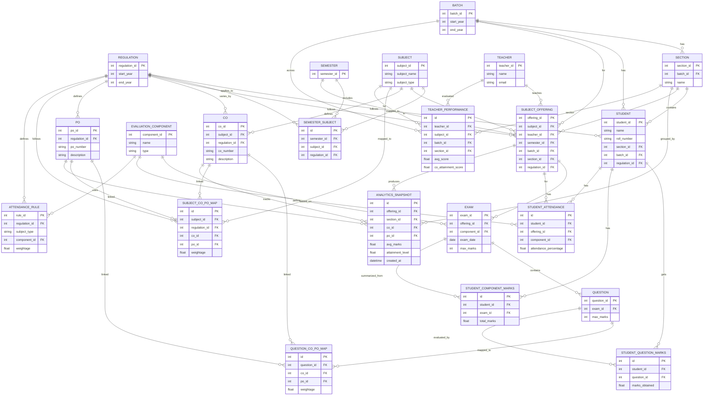

# CQI Analytics Engine Database Schema & Architecture

This document serves as the single source of truth for the Database Schema understanding, governing the data-fetching and analysis rules for the CQI Analytics Engine.

## System Design Principle
The backend follows a strictly decoupled approach:
- **Database (PostgreSQL)**: Serves exclusively as data storage.
- **Backend (Node.js)**: Acts as the primary computation engine. 

All analytics calculations are done cleanly mapping and reducing data in pure JavaScript functions, adhering to the principle of "fetch minimal required data, and calculate in Node".

---

## Key Data Insights

### 1. The Central Anchor: `SUBJECT_OFFERING`
Almost all analytics (performance, attendance, teacher evaluations) revolve around the `SUBJECT_OFFERING` entity. It effectively links:
- Who is teaching (`TEACHER`)
- What is being taught (`SUBJECT`)
- Who is learning (`BATCH`, `SECTION`)
- When it is taught (`SEMESTER`)
- Under which curriculum version (`REGULATION`)

Grouping SQL queries by `offering_id` is the primary filtering and entry point.

### 2. Regulatory Constraints
Both Course Outcomes (`CO`), Program Outcomes (`PO`), and `ATTENDANCE_RULE`s are strictly tied to a `REGULATION`. This guarantees that analysis inherently respects modifications to the syllabus or weightage over academic years.

### 3. Granularity of Evaluation
Rather than computing broad generalizations at the SQL level, we rely on the lowest possible bounds:
- **`STUDENT_QUESTION_MARKS`**: Marks tracked against individual questions.
- **`QUESTION_CO_PO_MAP`**: Questions are precisely linked to COs and POs with specific weightages.
  
*Data Flow:* `Student` -> `Question` -> `Marks` -> Node.js JS Compute -> `CO Attainment` -> `PO Attainment`.

### 4. Curriculum Target Baseline: `SUBJECT_CO_PO_MAP`
This static table represents the academic foundation or "desired mapping" defined by the syllabus or faculty.
- **Purpose**: It defines how strongly a Course Outcome (CO) contributes to a Program Outcome (PO) (with weightages typically 1–3) for a specific subject under a specific regulation.
- **Nature**: It is a macro-level, static curriculum target enforcing a unique constraint on `(subject_id, regulation_id, co_id, po_id)`, standing as the baseline to compare actual granular student performance against.

---

## Entity Relationship Diagram

